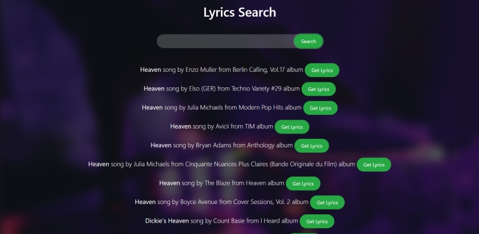

# Hard Rock Api

Website Link: [Hard Rock Api](https://rank0001.github.io/api-assignment/ "Hard Rock Api")
	
Created a javascript app where songs are fetched from an api
depending upon different search from users and displayed subsequently on the page

Environment : Javascript,html,css,bootstrap

- Users can search for any song in the search bar
- Based on users search 10 songs will be displayed which are fetched from the api

To run this app in your editor,clone this project and run the command npm start to start downloading the necessary packages.
